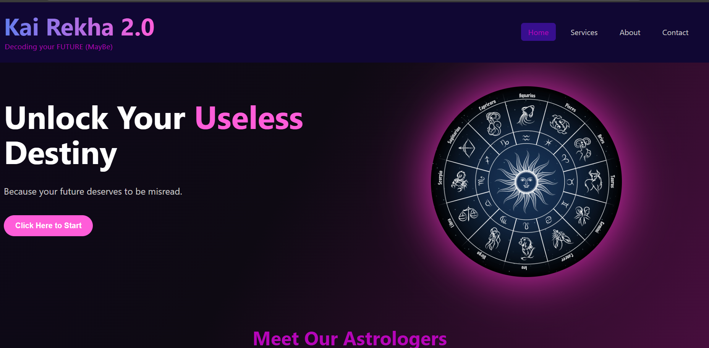
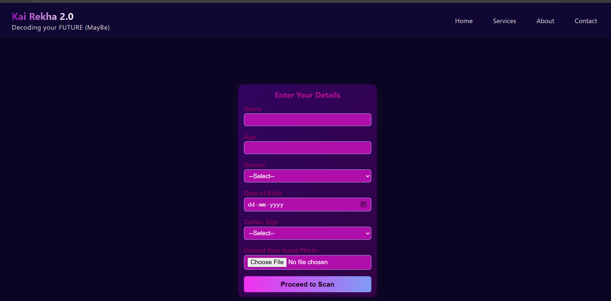
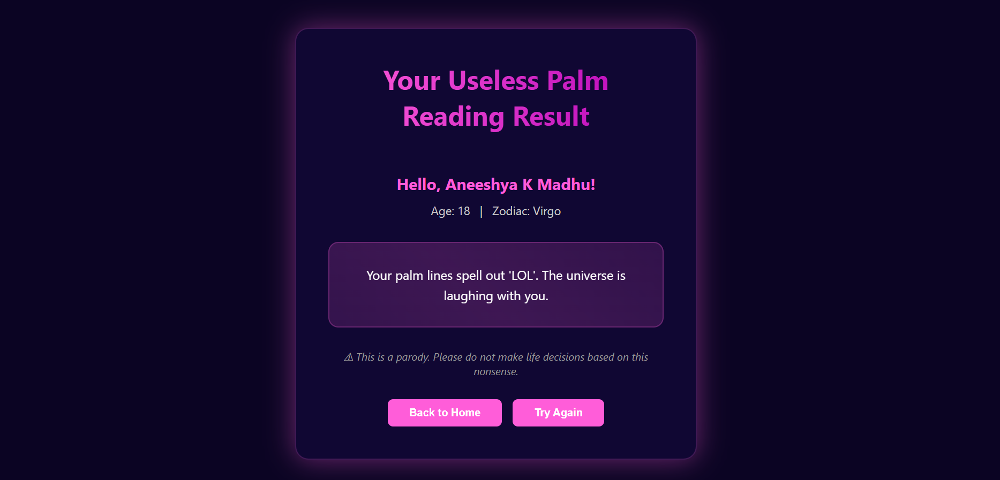

# [KAI REKHA 2.0] 🎯

## Basic Details
### Team Name: [Margin]

### Team Members

- Member 2: [Aneeshya K Madhu] - [GEC IDUKKI]
- Member 3: [Malavika K C] @malavikhaah - [GEC IDUKKI]

### Project Description
Kai Rekha 2.0 is a parody palm reading website that serves hilariously fake predictions. From sarcastic astrologers to absurd fortunes, it’s 0% accurate but 100% guaranteed to make you laugh.

### The Problem (that doesn't exist)
Too many people take astrology way too seriously. We solve this by giving completely useless, AI-generated predictions so you can stop worrying about your future… and start laughing at it instead.

### The Solution (that nobody asked for)
We combine AI, sarcasm, and random text generators to give you the most gloriously inaccurate predictions of your life — all from fake astrologers you definitely shouldn’t trust.

## Technical Details
### Technologies/Components Used
For Software:
- [HTML, CSS, JavaScript]

### Implementation
For Software:
# Installation
[# Clone the repository
git clone https://github.com/username/kai-rekha-2.0.git  

# Navigate into project folder
cd kai-rekha-2.0  
]

### Project Documentation
For Software:

#sreen recording
[https://drive.google.com/file/d/1tzM099QM2PQ9GR66Blc_r56wPXUlhANd/view?usp=drive_link]

 
# Diagrams
User enters details → System applies “fake logic” → Generates a fun prediction.
Made with ❤️ at TinkerHub Useless Projects 

